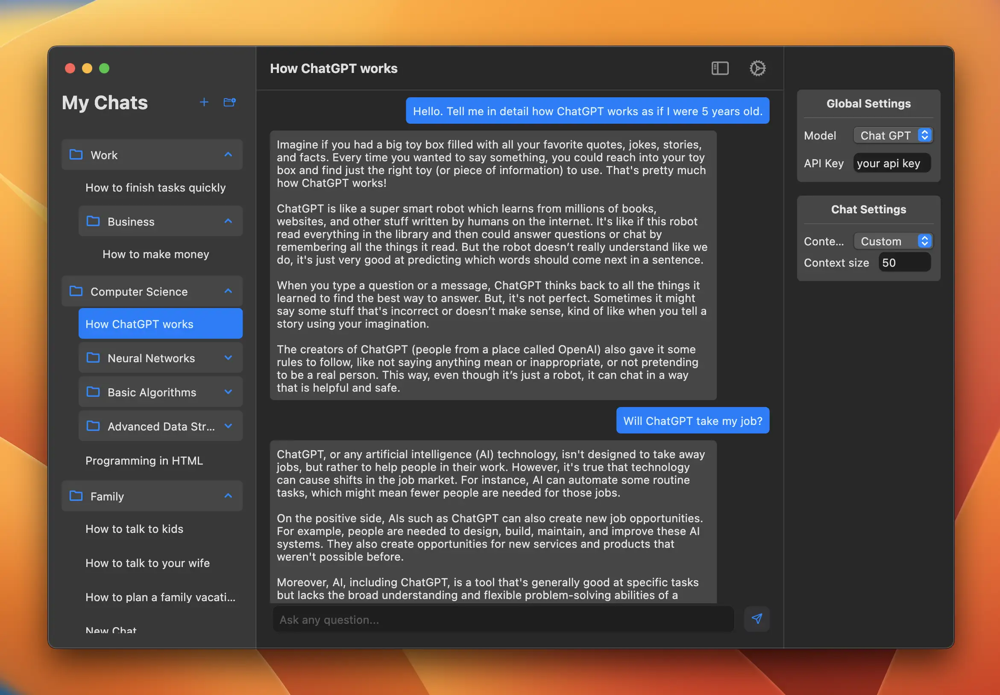

# Plain GPT

This is a MacOS chat app that supports ChatGPT and Gemini through an API key. Built using Flutter. 

### Features
- Chats using API keys to save costs
- Chats are organizedd inside folders
- Chats can be renamed
- Chats can be moved from one folder to another
- Model selection is available
- Custom context size
- Dark & Light themes

### Gallery

